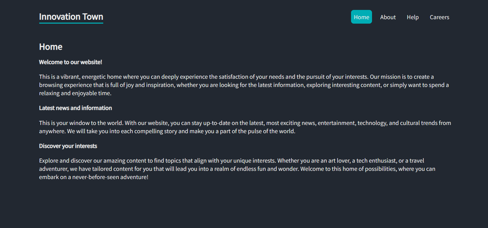
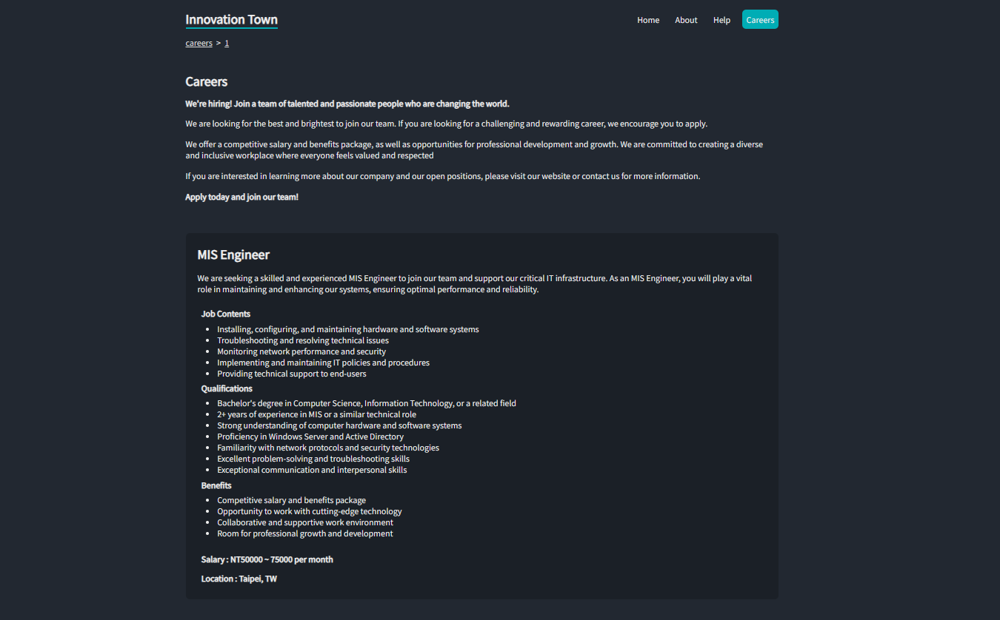
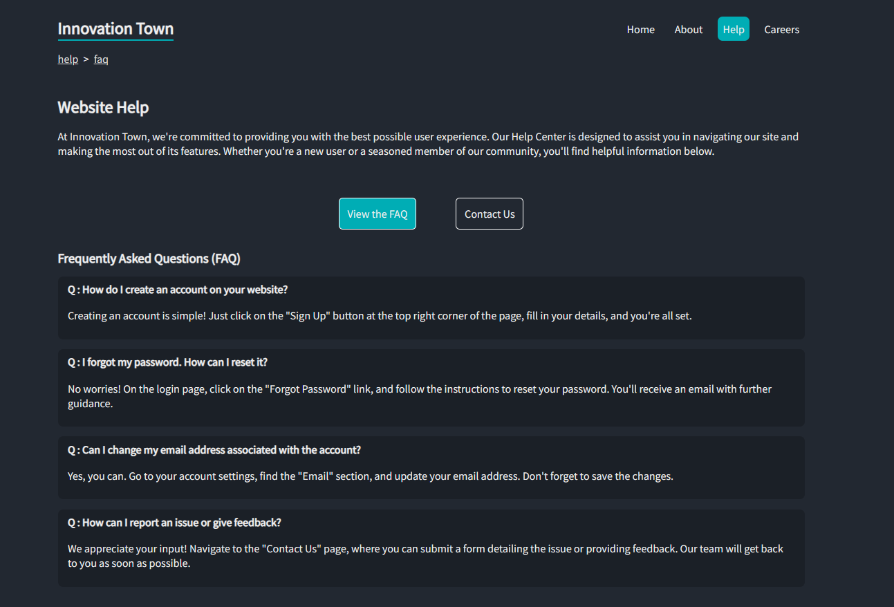

# Vite Router

## Setup

Global setup:

In order to fetch `career.json` (career page), you need to install [json-server](https://www.npmjs.com/package/json-server):

```bash
npm install -g json-server
```

Inside the project directory, run the following commands:

```bash
npm install
npm i react-router-dom

# Start the json-server
json-server -p 4000 -w ./data/careers.json
# Start the dev server
npm run dev
```

## Preview

### Home Page


### Career Page


### Support Page
